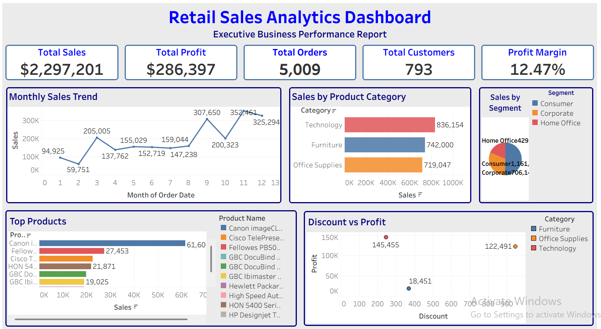

# 📊 Retail Sales Analytics Dashboard

An end-to-end Retail Sales Analytics project demonstrating data cleaning, exploratory data analysis (EDA), business analytics, and interactive dashboard development using Python and Tableau.

---

## Project Overview

Retail organizations generate vast amounts of transactional data every day. Converting this data into actionable insights enables better decision-making, improves operational efficiency, and increases profitability.

This project performs a comprehensive analysis of retail sales data to identify business trends, customer purchasing behavior, product performance, and regional sales patterns. The findings are presented through both Python-based analysis and an interactive Tableau dashboard.

---

## Business Problem

Business leaders need timely insights to answer critical questions such as:

- Which products generate the highest revenue?
- Which products reduce profitability?
- Which customer segments contribute the most sales?
- Which regions perform best?
- How do discounts impact profit?
- How do sales change over time?

This project addresses these questions using data-driven analysis and visualization.

---

## Dataset

This project uses the **Sample Superstore** retail dataset, a widely used dataset for learning and demonstrating business intelligence and data analytics techniques.

### Dataset Features

- Customer Information
- Product Details
- Sales
- Profit
- Discount
- Quantity
- Region
- State
- City
- Shipping Information
- Order Dates

> **Note:** The dataset is included for educational and portfolio purposes.

---
# Key Visualizations

## Project Workflow

- Business Understanding
- Data Loading
- Data Inspection
- Data Cleaning & Preprocessing
- Exploratory Data Analysis (EDA)
- Business Analytics
- Executive Summary
- Business Recommendations
- Tableau Dashboard Development

---

## Interactive Tableau Dashboard



---

## Executive KPI Summary


---

## Monthly Sales Trend


---

## Sales by Product Category


---

## Correlation Heatmap


---

## Top 10 Products by Sales


---

# Key Insights

- Technology products generated the highest overall sales revenue.
- Higher discount levels were generally associated with lower profitability.
- Sales performance varied significantly across regions and customer segments.
- A relatively small number of products contributed a substantial share of total revenue.
- Time-series analysis revealed clear fluctuations in sales over time, supporting seasonal business planning.

---

# Repository Structure

```text
Retail-Sales-Analytics/
│
├── data/
│   └── Sample - Superstore.csv
│
├── notebook/
│   └── Retail_Sales_Analytics.ipynb
│
├── dashboard/
│   └── Retail_Sales_Dashboard.twbx
│
├── images/
│   ├── dashboard.png
│   ├── executive_kpi_summary.png
│   ├── monthly_sales_trend.jpeg
│   ├── sales_by_product_category.png
│   ├── correlation_heatmap.jpeg
│   └── top_10_products.jpeg
│
├── README.md
├── requirements.txt
├── LICENSE
└── .gitignore
```

---

# Technologies Used

- Python
- Pandas
- NumPy
- Matplotlib
- Seaborn
- SciPy
- Jupyter Notebook
- Tableau

---

# How to Run

1. Clone this repository.

```bash
git clone https://github.com/your-username/Retail-Sales-Analytics.git
```

2. Install the required Python packages.

```bash
pip install -r requirements.txt
```

3. Open the Jupyter notebook located in the `notebook` folder.

4. Explore the interactive Tableau dashboard located in the `dashboard` folder.

---

# Future Improvements

- Build an interactive Streamlit dashboard.
- Develop predictive sales forecasting models.
- Perform customer segmentation using clustering techniques.
- Deploy the dashboard as a web application.
- Integrate live retail sales data.

---

# Author

**Mina Fatima**

Aspiring Data Analyst with a background in Biotechnology and a strong interest in Data Analytics, Business Intelligence, Machine Learning, and Artificial Intelligence.

---

⭐ *If you found this project useful, consider giving it a star.*
